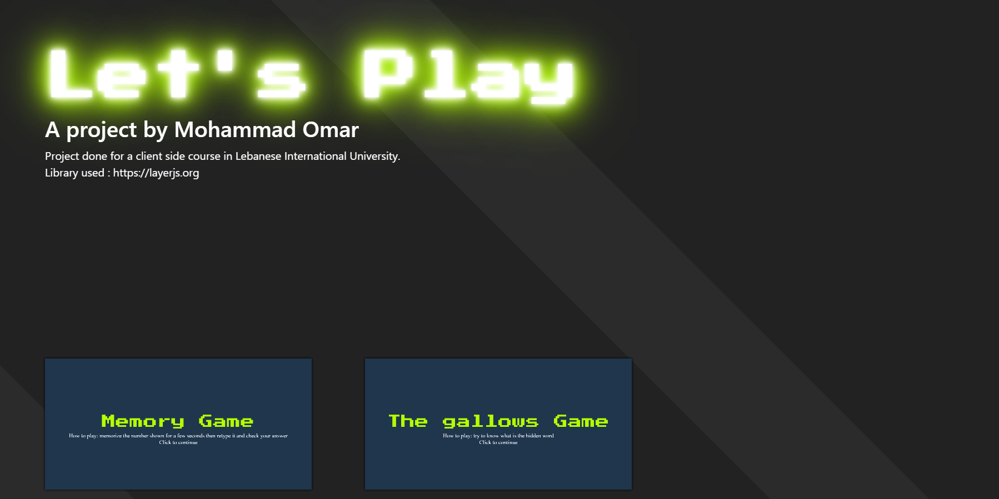
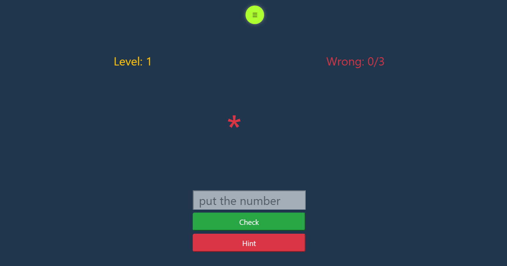
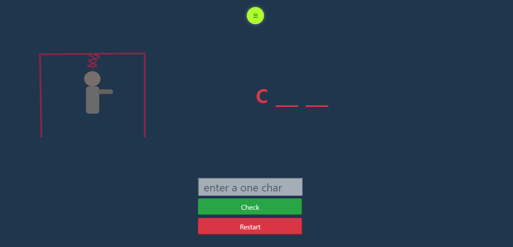

# javascript games
2 games build with javascript (vanilla js) with the help of html and css 

the project also include svgs and frames and use layerjs library ->  https://layerjs.org

# screenshots
# home screen

# memory game

# The gallows Game

